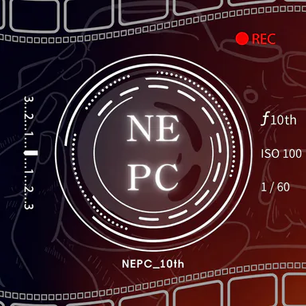

<div align="center">
  
  <h1>NEHS Photography Club Website</h1>
  <p>Editorial Swiss-style site for the NEHS photography club.</p>
  <p>
    <a href="./README.zh-TW.md">中文版</a>
    ·
    <a href="./LICENSING.md">Licensing</a>
    ·
    <a href="./docs/README.md">Docs</a>
  </p>
  <p>
    <a href="./LICENSE"></a>
    <a href="https://creativecommons.org/licenses/by-sa/4.0/"></a>
    
    
    = 20.9" />
  </p>
</div>

## Contents

- [Installation](#installation)
- [Quick Start](#quick-start)
- [How It Works](#how-it-works)
- [Project Structure](#project-structure)
- [Licensing](#licensing)
- [Documentation](#documentation)

## Installation

Prerequisites:

- Node.js `20.9.0` or newer (required by Next.js and Sharp).
- pnpm (`packageManager` is pinned to pnpm@10.15.1).

```bash
pnpm install --frozen-lockfile
```

Copy the environment template (placeholders only — never real secrets) and
fill it from the GitHub OAuth App plus project settings:

```bash
cp .env.example .env.local
```

`.env.local` is gitignored; `.env.example` stays checked in as the documented
contract. Variables:

| Variable | Visibility | Note |
| --- | --- | --- |
| `NEXT_PUBLIC_SITE_URL` | Public, optional | Canonical origin, defaults to `https://nehsnepc.com`. Never a secret. |
| `KEYSTATIC_GITHUB_CLIENT_ID` | Public identifier | OAuth App id, min 8 chars. |
| `KEYSTATIC_GITHUB_CLIENT_SECRET` | Server-only | OAuth App secret, min 20 chars. |
| `KEYSTATIC_SECRET` | Server-only | Session secret, min 32 chars. |
| `KEYSTATIC_GITHUB_REPO` | Pinned | Must stay `woodengrass/nehsnepc_website`. |
| `KEYSTATIC_PRODUCTION_ORIGIN` | Server-only | Exact production HTTPS origin, no trailing slash. |
| `NEXT_PUBLIC_KEYSTATIC_LOCAL_MODE` | Dev-only | `1` only for loopback `admin:dev`; never production/preview. |

Missing or short secrets fail closed (redacted 503 naming names only); wrong
origins get a redacted 403. Full rules and runbooks live in
[`docs/technical-stack.md`](./docs/technical-stack.md).

## Quick Start

| Command | When to run it |
| --- | --- |
| `npm run dev` | Local development (Turbopack) with article image pre-generation plus watch. GitHub-mode admin (no local writes). |
| `npm run admin:dev` | Loopback editor rehearsal: local Keystatic storage on `127.0.0.1` only. Never production/preview. |
| `npm run content:validate` | Fail-fast article contract check. Runs automatically in `prebuild`. |
| `pnpm test:content` | Content quality gate (validator plus contract spec). |
| `pnpm test:admin` | Admin browser gate (Playwright loopback CRUD, draft/publication surfaces, auth negatives, bundle isolation). |
| `npm run build` | Production build. This is the **release gate** — no lint, formatter, or standalone typecheck is configured. |
| `npm run start` | Serve the production build locally. |
| `npm run images:build` | After changing source images. Regenerates committed AVIF/WebP families plus article derivatives (requires `sharp`). |
| `npm run images:articles` | Article derivatives only (also runs in `prebuild` and the dev watcher). |
| `npm run models:build` | After changing GLB sources in `public/models/src/`. Writes optimized files to `public/models/opt/`. |
| `pnpm test:content` | Content contract: validator + contract spec (fast, no server). |
| `pnpm test:admin` | Admin workflow: static guards, then loopback browser specs, then the draft/publish orchestrator with production smoke (each phase manages and tears down its own server). |

Release sequence:

```bash
pnpm install --frozen-lockfile
npm run content:validate
pnpm test:content
pnpm test:admin
npm run build
```

`prebuild` (validator plus article images) runs automatically before `build`;
non-article asset pipelines are **not** part of `build` — run them separately
before building whenever those sources change.

## How It Works

**Server-first rendering.** Routes are React Server Components by default.
Client components exist only around browser behavior: navigation, the About
focus experience, contact interactions, the exposure calculator, reading
progress, and 3D model previews.

**Heavy runtimes stay isolated and lazy.** Three.js (About archive), GSAP (About
story), and `@google/model-viewer` (article embeds) are dynamically imported
only on the routes that need them — never in shared layout or navigation.
Keep it that way.

**Filesystem content, browser editor.** Articles live in `content/articles/*.mdx`
with Zod-validated frontmatter ([`lib/content.ts`](./lib/content.ts), strict
contract [`lib/content-contract.ts`](./lib/content-contract.ts)).
Non-draft routes are enumerated at build time, so every content change requires
a rebuild. The `/admin` gateway leads into the Keystatic GitHub-mode editor
(`/keystatic`): repo writers sign in with GitHub and save structured articles
as ordinary Git commits. New editor entries default to `draft: true`; saves commit to a `preview/<github-username>` branch created through the editor's branch dialog, and `main` is branch-protected so nothing lands there except through a pull request. The repository is
public, so committed drafts are world-readable on GitHub even while five
website surfaces (article route, index, category pages, sitemap, RSS) exclude
them — drafts are unpublished, never confidential. Details live in
[`docs/posts.md`](./docs/posts.md) and runbooks in
[`docs/technical-stack.md`](./docs/technical-stack.md).

**Exposure calculator shape.**
[`components/tools/ExposureCalculator.tsx`](./components/tools/ExposureCalculator.tsx)
is a controlled React client component; all photographic math lives as pure
functions in [`lib/exposure/exposure.ts`](./lib/exposure/exposure.ts).
Details live in [`docs/tools.md`](./docs/tools.md).

**SEO is generated, not hand-written.** Sitemap, robots, RSS, and the OG image
are routes derived from the same content source ([`lib/seo.tsx`](./lib/seo.tsx),
[`app/sitemap.ts`](./app/sitemap.ts), [`app/robots.ts`](./app/robots.ts),
[`app/rss.xml/route.ts`](./app/rss.xml/route.ts),
[`app/opengraph-image.tsx`](./app/opengraph-image.tsx)).

## Project Structure

```text
app/                    Routes (App Router). layout.tsx, page.tsx per section,
                        sitemap/robots/rss/og-image routes, globals.css
  about/                Camera-obscura focus experience
  admin/                Noindex Traditional Chinese gateway into /keystatic
  api/keystatic/        Lazy fail-closed Keystatic route handler
  contact/              Contact channels + request form
  keystatic/            OAuth-gated editor UI (noindex, preview-disabled)
  tools/                Tool catalogue + exposure-calculator route
  tutorial/             Article index, category/[category], [slug]
components/             UI by area: home, about, contact, tools,
                        articles, mdx (Figure, Callout, Model3D, MDXLink)
lib/                    Shared code: content.ts, content-contract.ts, tools.ts,
                        seo.tsx, og.tsx, format.ts, about_content.ts,
                        archive_scene.js, exposure/ (pure calculator module),
                        keystatic/ (storage gates, image naming)
content/articles/       Repository-owned MDX articles
assets/articles/        Tracked versioned article image sources
public/                 Static assets: images/generated/
                        (committed non-article variants; article derivatives
                        plus manifest are gitignored build artifacts),
                        models/src|opt/
assets/                 Versioned image sources: sources/, satellites/
scripts/                optimize_images.js, optimize_article_images.js,
                        validate_articles.ts, dev_with_article_images.mjs,
                        optimize_models.js, test_admin_workflow.ts
keystatic.config.ts     Editor schema (structure mirrors components/mdx/*)
.env.example            Placeholder-only env template (copy to .env.local)
docs/                   Maintained technical reference, one document per area
```

## Licensing

- Source code: MIT — see [`LICENSE`](./LICENSE).
- Photographs: © NEHS Photography Club, all rights reserved, except five About
  satellite images (`06`–`10`) used under the Unsplash License with attribution.
- Tutorial articles: CC BY-SA 4.0.

Full map and Unsplash credits: [`LICENSING.md`](./LICENSING.md) and the
[`/licensing`](https://nehsnepc.com/licensing) page.

## Documentation

Area-specific detail lives in [`docs/`](./docs/). Each document owns its area:

| Area | Document |
| --- | --- |
| Shared UI and visual system | [Frontend Architecture](./docs/frontend.md) |
| Tool catalogue and exposure calculator | [Tools](./docs/tools.md) |
| Contact channels and request form | [Contact](./docs/contact.md) |
| Camera-obscura and archive experience | [About](./docs/about.md) |
| MDX articles and publication surfaces | [Posts](./docs/posts.md) |
| Embedded GLB preview and optimization | [3D Model Preview](./docs/model-preview.md) |
| Runtime, builds, assets, SEO, and deployment | [Technical Stack](./docs/technical-stack.md) |

Documentation is part of the implementation: update the owning document in the
same change as the code. See [docs/README.md](./docs/README.md) for the full
maintenance contract and verification baseline.
