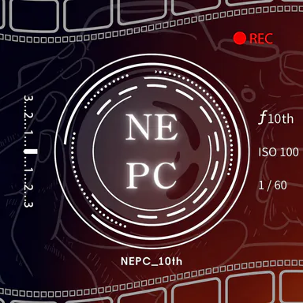

<div align="center">
  
  <h1>NEHS 攝影社網站</h1>
  <p>編輯式瑞士風格的攝影社網站。</p>
  <p>
    <a href="./README.md">English</a>
    ·
    <a href="./LICENSING.md">授權方式</a>
    ·
    <a href="./docs/README.md">技術文件</a>
  </p>
  <p>
    <a href="./LICENSE"></a>
    <a href="https://creativecommons.org/licenses/by-sa/4.0/"></a>
    
    
    = 20.9" />
  </p>
</div>

## 目錄

- [安裝](#安裝)
- [快速開始](#快速開始)
- [運作方式](#運作方式)
- [專案結構](#專案結構)
- [授權](#授權)
- [文件](#文件)

## 安裝

需求：

- Node.js `20.9.0` 以上（Next.js 與 Sharp 要求）。
- pnpm（`packageManager` 鎖定為 pnpm@10.15.1）。

```bash
pnpm install
```

唯一的應用程式環境變數為選填：

```bash
NEXT_PUBLIC_SITE_URL=https://nehsnepc.com
```

未設定時預設為 `https://nehsnepc.com`，控制 canonical URL、metadata base、
JSON-LD、sitemap、robots 與 RSS 連結。這是公開值，不可放機密。 repo 內沒有
`.env` 檔案。

## 快速開始

| 指令 | 何時執行 |
| --- | --- |
| `npm run dev` | 本地開發（Turbopack）。 |
| `npm run build` | 正式建置。這是**唯一的自動化品質關卡**——沒有 lint、test、formatter 或獨立 typecheck。 |
| `npm run start` | 本地跑正式建置結果。 |
| `npm run images:build` | 改過來源圖片後執行。重新產生 AVIF/WebP 到 `public/images/generated/`（需 `sharp`）。 |
| `npm run models:build` | 改過 `public/models/src/` 的 GLB 後執行。輸出最佳化檔案到 `public/models/opt/`。 |

素材管線**不包含**在 `npm run build` 內；來源有改就要先跑對應指令再 build。

## 運作方式

**Server-first 渲染。** 路由預設是 React Server Component，只有瀏覽器行為才開
client 邊界：導覽、About 對焦體驗、聯絡互動、曝光計算器、閱讀進度、3D 模型預覽。

**重型 runtime 隔離且 lazy。** Three.js（About archive）、GSAP（About 故事線）、
`@google/model-viewer`（文章內嵌）都只在需要的路由動態載入——絕不
進 shared layout 或導覽。保持這樣。

**檔案系統內容，不是 CMS。** 文章在 `content/articles/*.mdx`，frontmatter 由
Zod 驗證（[`lib/content.ts`](./lib/content.ts)）。非草稿路由在建置期列舉，所以
改內容就要重 build。`draft: true` 的文章只出現在開發環境。

**曝光計算器形狀。**
[`components/tools/ExposureCalculator.tsx`](./components/tools/ExposureCalculator.tsx)
是受控的 React client 元件，攝影數學以純函數放在
[`lib/exposure/exposure.ts`](./lib/exposure/exposure.ts)。細節見
[`docs/tools.md`](./docs/tools.md)。

**SEO 用產的，不用手寫的。** Sitemap、robots、RSS、OG 圖都是路由，從同一內容
來源產生（[`lib/seo.tsx`](./lib/seo.tsx)、[`app/sitemap.ts`](./app/sitemap.ts)、
[`app/robots.ts`](./app/robots.ts)、[`app/rss.xml/route.ts`](./app/rss.xml/route.ts)、
[`app/opengraph-image.tsx`](./app/opengraph-image.tsx)）。

## 專案結構

```text
app/                    路由（App Router）。各區 layout.tsx、page.tsx，
                        sitemap/robots/rss/og-image 路由、globals.css
  about/                暗箱對焦體驗
  contact/              聯絡管道＋表單
  tools/                工具索引＋曝光計算器路由
  tutorial/             文章首頁、category/[category]、[slug]
components/             依區域分的 UI：home、about、contact、tools、
                        articles、mdx（Figure、Callout、Model3D、MDXLink）
lib/                    共用程式：content.ts、tools.ts、seo.tsx、og.tsx、
                        format.ts、about_content.ts、archive_scene.js、
                        exposure/（純計算器模組）
content/articles/       repo 自管的 MDX 文章
public/                 靜態素材：images/generated/
                        （已提交的變體）、models/src|opt/
assets/                 版控圖片來源：sources/、satellites/
scripts/                optimize_images.js、optimize_models.js
docs/                   各領域技術文件，一個領域一份
```

## 授權

- 程式碼：MIT，見 [`LICENSE`](./LICENSE)。
- 照片：© NEHS 攝影社，版權所有；About 衛星圖 `06`–`10` 共五張依 Unsplash
  License 使用並標註出處。
- 教學文章：CC BY-SA 4.0。

完整對照與 Unsplash 出處：[`LICENSING.md`](./LICENSING.md) 與
[`/licensing`](https://nehsnepc.com/licensing) 頁。

## 文件

各領域細節在 [`docs/`](./docs/)，一份文件擁有一個領域：

| 領域 | 文件 |
| --- | --- |
| 共用 UI 與視覺系統 | [Frontend Architecture](./docs/frontend.md) |
| 工具索引與曝光計算器 | [Tools](./docs/tools.md) |
| 聯絡管道與表單 | [Contact](./docs/contact.md) |
| 暗箱與典藏體驗 | [About](./docs/about.md) |
| MDX 文章與發布 | [Posts](./docs/posts.md) |
| GLB 預覽與最佳化 | [3D Model Preview](./docs/model-preview.md) |
| Runtime、建置、素材、SEO、部署 | [Technical Stack](./docs/technical-stack.md) |

文件是實作的一部分：改程式就要在同一個 change 更新所屬文件。完整維護契約與
驗證基準見 [docs/README.md](./docs/README.md)。
